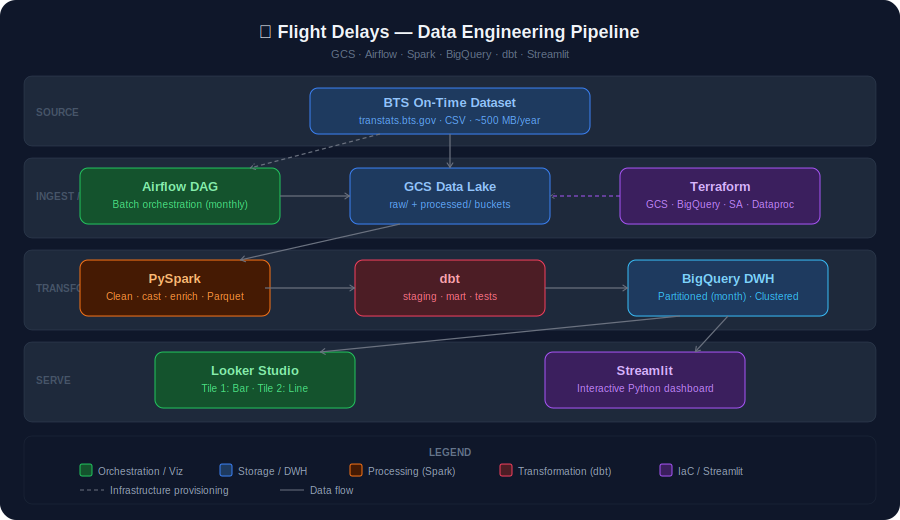

# US Flight Delays — Data Engineering Project



---

## Table of Contents

- [Problem Statement](#problem-statement)
- [Architecture Overview](#architecture-overview)
- [Tech Stack](#tech-stack)
- [Project Structure](#project-structure)
- [Prerequisites](#prerequisites)
- [Quickstart](#quickstart)
  - [1. Clone & Setup](#1-clone--setup)
  - [2. Configure GCP](#2-configure-gcp)
  - [3. Provision Infrastructure (Terraform)](#3-provision-infrastructure-terraform)
  - [4. Start Services (Docker Compose)](#4-start-services-docker-compose)
  - [5. Trigger the Pipeline (Airflow)](#5-trigger-the-pipeline-airflow)
  - [6. Run dbt Models](#6-run-dbt-models)
  - [7. View the Dashboard](#7-view-the-dashboard)
- [Pipeline Details](#pipeline-details)
  - [Data Ingestion](#data-ingestion)
  - [Spark Transformation](#spark-transformation)
  - [BigQuery Schema](#bigquery-schema)
  - [dbt Models](#dbt-models)
  - [Dashboard Tiles](#dashboard-tiles)
- [Evaluation Criteria Coverage](#evaluation-criteria-coverage)
- [Development](#development)
- [Troubleshooting](#troubleshooting)

---

## Problem Statement

The US Bureau of Transportation Statistics (BTS) publishes monthly flight on-time performance data covering every domestic flight operated by major carriers. This dataset captures departure/arrival delays, cancellations, and delay causes — but in its raw form it is not readily queryable for trend analysis or carrier comparison.

**This project builds a fully automated batch pipeline that:**

1. Downloads monthly BTS On-Time Performance CSV files
2. Stores raw data in a GCS data lake
3. Cleans, enriches, and converts data to Parquet using PySpark on Dataproc
4. Loads processed data into BigQuery (partitioned + clustered for efficiency)
5. Transforms the data into analytics-ready mart tables using dbt
6. Visualises insights on a two-tile Streamlit dashboard

The result is a reproducible, cloud-native pipeline that answers questions like:  
*"Which airlines are most delayed? How do delays vary by season?"*

---

## Architecture Overview

```
BTS Website (CSV)
      │
      ▼
┌─────────────┐     ┌───────────────────────┐
│  Airflow    │────▶│  GCS (raw bucket)      │
│  DAG        │     │  gs://.../raw/YYYY/MM/ │
└─────────────┘     └───────────┬───────────┘
      │                         │
      │  (triggers)             ▼
      │             ┌───────────────────────┐
      └────────────▶│  PySpark (Dataproc)   │
                    │  Clean · Enrich ·      │
                    │  Write Parquet         │
                    └───────────┬───────────┘
                                │
                                ▼
                    ┌───────────────────────┐
                    │  GCS (processed)       │
                    │  Partitioned Parquet   │
                    └───────────┬───────────┘
                                │
                                ▼
                    ┌───────────────────────┐
                    │  BigQuery (staging)    │
                    │  Partitioned by month  │
                    │  Clustered by carrier  │
                    └───────────┬───────────┘
                                │
                                ▼
                    ┌───────────────────────┐
                    │  dbt                   │
                    │  stg_flights           │
                    │  fct_flights           │
                    │  rpt_delay_by_carrier  │
                    │  rpt_delay_trend       │
                    └───────────┬───────────┘
                                │
                    ┌───────────┴───────────┐
                    ▼                       ▼
          ┌──────────────┐       ┌──────────────────┐
          │ Looker Studio │       │    Streamlit      │
          │  (Tile 1+2)   │       │   Dashboard       │
          └──────────────┘       └──────────────────┘
```

**Infrastructure as Code:** All GCP resources (GCS buckets, BigQuery datasets, Dataproc cluster, service account) are provisioned with Terraform.

---

## Tech Stack

| Layer | Tool | Purpose |
|---|---|---|
| Cloud | **GCP** | All infrastructure |
| IaC | **Terraform** | Provision GCS, BigQuery, Dataproc, IAM |
| Orchestration | **Apache Airflow** | Batch DAG (monthly schedule) |
| Data Lake | **Google Cloud Storage** | Raw CSV + processed Parquet |
| Processing | **PySpark on Dataproc** | Cleaning, enrichment, type-casting |
| Data Warehouse | **BigQuery** | Partitioned + clustered fact tables |
| Transformation | **dbt** | Staging views, mart tables, tests |
| Dashboard | **Streamlit + Plotly** | Two-tile interactive dashboard |
| CI/CD | **GitHub Actions** | Lint, test, terraform plan, deploy |
| Containerisation | **Docker Compose** | Local dev environment |

---

## Project Structure

```
flights-de-project/
├── assets/
│   └── architecture.svg          # Architecture diagram
├── airflow/
│   └── dags/
│       └── flights_pipeline.py   # 7-step Airflow DAG
├── spark/
│   └── spark_transform.py        # PySpark cleaning & enrichment job
├── dbt/
│   ├── dbt_project.yml
│   ├── profiles.yml
│   └── models/
│       ├── staging/
│       │   ├── sources.yml
│       │   └── stg_flights.sql
│       └── mart/
│           ├── schema.yml
│           ├── dim_carriers.sql
│           ├── fct_flights.sql          # Core fact table (partitioned + clustered)
│           ├── rpt_delay_by_carrier.sql # Dashboard tile 1
│           └── rpt_delay_trend.sql      # Dashboard tile 2
├── dashboard/
│   └── app.py                    # Streamlit dashboard
├── terraform/
│   ├── main.tf                   # GCS, BigQuery, Dataproc, IAM
│   ├── variables.tf
│   ├── outputs.tf
│   └── terraform.tfvars.example
├── tests/
│   └── test_spark_transform.py   # Unit tests for PySpark job
├── scripts/
│   └── setup.sh                  # One-time local setup helper
├── .github/
│   └── workflows/
│       └── ci.yml                # GitHub Actions CI/CD
├── .env.example
├── .gitignore
├── docker-compose.yml
└── requirements.txt
```

---

## Prerequisites

| Tool | Version | Install |
|---|---|---|
| Python | ≥ 3.11 | [python.org](https://python.org) |
| Docker + Compose | latest | [docker.com](https://docker.com) |
| Terraform | ≥ 1.3 | [terraform.io](https://developer.hashicorp.com/terraform/install) |
| Google Cloud SDK | latest | [cloud.google.com/sdk](https://cloud.google.com/sdk/docs/install) |
| GCP Account | — | [console.cloud.google.com](https://console.cloud.google.com) |

You will also need a GCP project with billing enabled and the following APIs enabled:

```bash
gcloud services enable \
  storage.googleapis.com \
  bigquery.googleapis.com \
  dataproc.googleapis.com \
  iam.googleapis.com
```

---

## Quickstart

### 1. Clone & Setup

```bash
git clone https://github.com/your-username/flights-de-project.git
cd flights-de-project

# Run one-time setup (creates venv, copies .env and tfvars templates)
bash scripts/setup.sh
```

### 2. Configure GCP

**Create a service account key:**

```bash
# Create SA (if not using Terraform yet)
gcloud iam service-accounts create flights-pipeline-sa \
  --display-name="Flights DE Pipeline SA"

# Grant roles
gcloud projects add-iam-policy-binding YOUR_PROJECT_ID \
  --member="serviceAccount:flights-pipeline-sa@YOUR_PROJECT_ID.iam.gserviceaccount.com" \
  --role="roles/storage.admin"

gcloud projects add-iam-policy-binding YOUR_PROJECT_ID \
  --member="serviceAccount:flights-pipeline-sa@YOUR_PROJECT_ID.iam.gserviceaccount.com" \
  --role="roles/bigquery.admin"

# Download key
gcloud iam service-accounts keys create keys/sa-key.json \
  --iam-account=flights-pipeline-sa@YOUR_PROJECT_ID.iam.gserviceaccount.com
```

**Edit `.env`:**

```bash
cp .env.example .env
# Then open .env and set:
#   GCP_PROJECT_ID=your-actual-project-id
#   GCS_RAW_BUCKET=your-actual-project-id-flights-raw
#   GCS_PROCESSED_BUCKET=your-actual-project-id-flights-processed
```

### 3. Provision Infrastructure (Terraform)

```bash
cd terraform
cp terraform.tfvars.example terraform.tfvars
# Edit terraform.tfvars: set project_id = "your-actual-project-id"

terraform init
terraform plan    # Review what will be created
terraform apply   # Type 'yes' to confirm

cd ..
```

This creates:
- GCS bucket: `YOUR_PROJECT-flights-raw`
- GCS bucket: `YOUR_PROJECT-flights-processed`
- BigQuery dataset: `flights_staging`
- BigQuery dataset: `flights_mart`
- Dataproc cluster: `flights-spark-cluster`
- Service account + IAM bindings

### 4. Start Services (Docker Compose)

```bash
# Linux: set AIRFLOW_UID first
echo "AIRFLOW_UID=$(id -u)" >> .env

docker-compose up -d

# Wait ~30s for Airflow to initialise, then check:
docker-compose ps
```

Services started:
| Service | URL |
|---|---|
| Airflow UI | http://localhost:8080 (admin / admin) |
| Streamlit Dashboard | http://localhost:8501 |
| PostgreSQL (metadata) | localhost:5432 |

### 5. Trigger the Pipeline (Airflow)

1. Open http://localhost:8080
2. Log in with **admin / admin**
3. Find the DAG **`flights_batch_pipeline`**
4. Toggle it **ON** using the slider
5. Click ▶ **Trigger DAG** to run immediately (uses prior month's data)
6. Watch the task graph — each step should go green in order

The DAG runs these tasks sequentially:
```
download_bts_data
  → upload_raw_to_gcs
    → upload_spark_script
      → run_spark_job
        → load_to_bigquery
          → run_dbt_staging
            → run_dbt_mart
              → notify_success
```

### 6. Run dbt Models

You can also run dbt manually from your local machine:

```bash
source .venv/bin/activate
cd dbt

export DBT_PROJECT_ID=your-project-id
export GOOGLE_APPLICATION_CREDENTIALS=../keys/sa-key.json

# Run all models
dbt run --profiles-dir . --target prod

# Run only staging
dbt run --select staging --profiles-dir . --target prod

# Run mart + tests
dbt run  --select mart --profiles-dir . --target prod
dbt test --select mart --profiles-dir . --target prod

# Generate docs
dbt docs generate && dbt docs serve
```

### 7. View the Dashboard

Open **http://localhost:8501** in your browser.

The dashboard displays:

**Tile 1 — Delay by Airline (categorical)**  
Bar chart ranking airlines by average arrival delay, with delay cause breakdown.

**Tile 2 — Monthly Delay Trend (temporal)**  
Line chart showing delay evolution over time with a 3-month rolling average, plus a stacked area of delay causes.

---

## Pipeline Details

### Data Ingestion

- **Source:** BTS On-Time Reporting Carrier On-Time Performance (`transtats.bts.gov`)
- **Format:** ZIP containing CSV, ~500 MB/year, ~7M rows/year
- **Schedule:** Monthly batch (5th of each month, processes prior month)
- **Raw storage:** `gs://PROJECT-flights-raw/raw/YYYY/MM/flights.csv`

### Spark Transformation

The PySpark job (`spark/spark_transform.py`) applies:

| Step | Detail |
|---|---|
| Column rename | All columns converted to snake_case |
| Type casting | Dates → `DateType`, delays → `FloatType`, flight numbers → `IntegerType` |
| Null filtering | Drops rows missing `fl_date`, `origin`, `dest`, or `mkt_carrier` |
| Outlier removal | Removes rows where `abs(arr_delay) > 1440` min (data errors) |
| `is_delayed` flag | `True` when `arr_delay > 15 min` |
| `delay_bucket` | Categorical: On time / Minor / Moderate / Severe / Extreme |
| `primary_delay_cause` | Carrier / Weather / NAS / Late Aircraft (largest component) |
| `total_delay` | `COALESCE(arr_delay, 0)` |
| Date parts | `year`, `month` columns for partitioning |
| Output | Snappy Parquet, partitioned by `year/month` |

### BigQuery Schema

**Fact table: `flights_mart.fct_flights`**

| Partition | Cluster | Reason |
|---|---|---|
| `fl_date` (MONTH) | `carrier_code`, `origin_airport` | Dashboard queries always filter by date range; clustering reduces bytes scanned within each partition for carrier/airport group-bys |

This design means a query like:
```sql
SELECT carrier_name, AVG(arr_delay)
FROM flights_mart.fct_flights
WHERE fl_date BETWEEN '2024-01-01' AND '2024-12-31'
  AND carrier_code = 'AA'
GROUP BY 1
```
...will only scan partitions within 2024 and only the `AA` blocks within those partitions — typically 10–100× cheaper than a full table scan.

### dbt Models

```
staging/
  stg_flights          → View: light cleaning, dedupe, null filters, remove cancelled

mart/
  dim_carriers         → Static table: IATA code → airline name
  fct_flights          → Partitioned fact table (partitioned + clustered)
  rpt_delay_by_carrier → Aggregated by carrier (dashboard tile 1)
  rpt_delay_trend      → Aggregated by month (dashboard tile 2)
```

dbt tests run automatically after each mart build:
- `unique` + `not_null` on all primary keys
- `accepted_values` for `is_delayed`, `delay_bucket`
- `expression_is_true` for `delay_pct` between 0–100%

### Dashboard Tiles

| Tile | Chart type | Metric | dbt model |
|---|---|---|---|
| 1 | Horizontal bar | Avg arrival delay by airline | `rpt_delay_by_carrier` |
| 1b | Stacked bar | Delay cause breakdown by carrier | `rpt_delay_by_carrier` |
| 2 | Line + bar | Monthly avg delay + total flights | `rpt_delay_trend` |
| 2b | Stacked area | Monthly delay causes over time | `rpt_delay_trend` |

---


---

## Development

### Run tests locally

```bash
source .venv/bin/activate
pytest tests/ -v
```

### Lint

```bash
black airflow/ spark/ dashboard/
```

### Add a new month of data manually

```bash
# Upload a CSV directly to GCS and trigger Airflow manually:
gcloud storage cp your_file.csv gs://PROJECT-flights-raw/raw/2024/06/flights.csv

# Then trigger the DAG from UI or CLI:
docker-compose exec airflow-scheduler \
  airflow dags trigger flights_batch_pipeline
```

---

## Troubleshooting

**Airflow DAG not visible**
```bash
docker-compose exec airflow-scheduler airflow dags list
docker-compose logs airflow-scheduler | tail -50
```

**Spark job fails on Dataproc**
- Check the Dataproc job logs in GCP Console → Dataproc → Jobs
- Ensure the service account has `roles/dataproc.worker`
- Verify `SPARK_JOB_FILE` is uploaded: `gcloud storage ls gs://PROJECT-flights-raw/scripts/`

**dbt connection error**
```bash
export GOOGLE_APPLICATION_CREDENTIALS=./keys/sa-key.json
cd dbt && dbt debug --profiles-dir .
```

**BigQuery permission denied**
- Ensure the SA has `roles/bigquery.admin` on the project
- Verify the correct project ID is set in `.env` and `terraform.tfvars`

**Dashboard shows no data**
- Confirm the full pipeline has run (all Airflow tasks green)
- Check BigQuery: `SELECT COUNT(*) FROM flights_mart.rpt_delay_by_carrier`
- Verify `GCP_PROJECT_ID` env var is set in the dashboard container

---